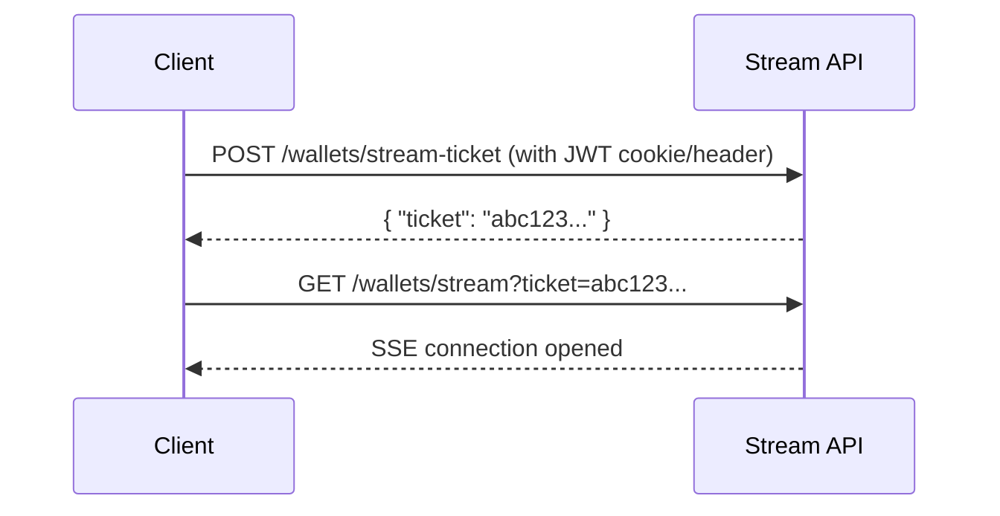

## Overview

The browser `EventSource` API cannot send cookies or custom headers on cross-origin requests. This endpoint lets you exchange a valid JWT for a **single-use, short-lived ticket** that you then pass as a query parameter when opening the SSE stream.

## Authentication

Send your JWT as either:
- **Cookie:** `klarity_access_token=<jwt>` (automatic for same-origin browser requests)
- **Header:** `klarity_access_token: <jwt>` (for server-side requests from Next.js API routes)

The JWT must be signed with **HS256** using the shared secret. The user ID is extracted from the `sub` claim.

## Ticket Properties

| Property | Value |
|----------|-------|
| Entropy | 256-bit cryptographically random |
| TTL | 30 seconds |
| Usage | Single-use (consumed on first SSE connection) |
| Tied to | The authenticated user's ID |

## Usage Flow



1. Call `POST /wallets/stream-ticket` with your JWT
2. Receive `{ "ticket": "abc123..." }`
3. Open `new EventSource('/wallets/stream?ticket=abc123...')`

<Warning>
Tickets expire after **30 seconds** and can only be used **once**. Request a new ticket each time you need to open an SSE connection.
</Warning>

<RequestExample>
```bash cURL
curl -X POST "https://ws.klarity.trade/stream/wallets/stream-ticket" \
  -H "klarity_access_token: eyJhbGciOiJIUzI1NiJ9..."
```

```javascript JavaScript
// From Next.js API route (server-side)
const res = await fetch('https://ws.klarity.trade/stream/wallets/stream-ticket', {
  method: 'POST',
  headers: { klarity_access_token: accessToken },
});
const { ticket } = await res.json();

// From browser (same-origin, cookie sent automatically)
const res = await fetch('/stream/wallets/stream-ticket', {
  method: 'POST',
  credentials: 'include',
});
const { ticket } = await res.json();

// Then open SSE
const eventSource = new EventSource(
  `/stream/wallets/stream?ticket=${ticket}`
);
```
</RequestExample>

<ResponseExample>
```json
{
  "ticket": "JkcrecSuaoqvtMqfzP37RxPNho-lTJWEeMNEQ59-qUA"
}
```
</ResponseExample>
